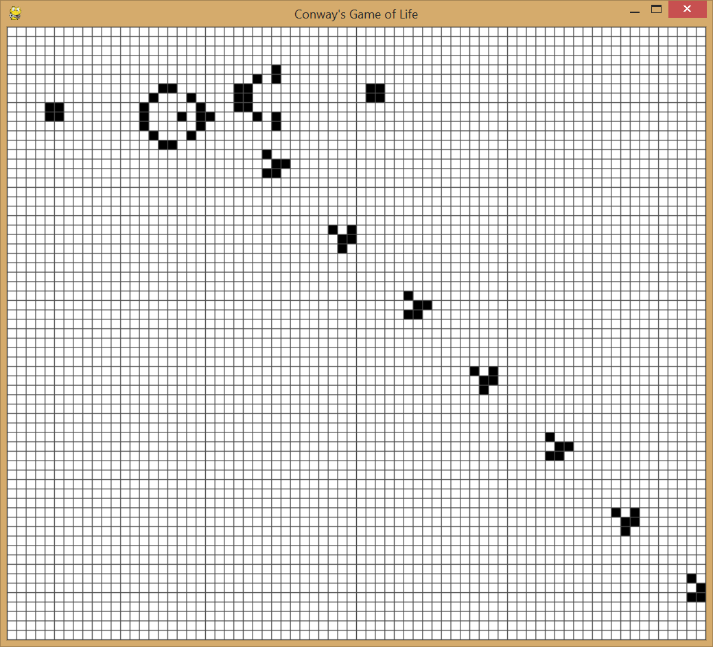

# Conway's Game of Life

## Overview

This project implements a finite variation of [Conway's Game of Life](https://en.wikipedia.org/wiki/Conway%27s_Game_of_Life) using Pygame.

## How to run this program

1. Download gui.py and life.py.
2. If you don't already have it, [install Pygame](https://www.pygame.org/wiki/GettingStarted).
3. In the console/command prompt, navigate to the folder that holds the two .py files and enter the command "pything gui.py."

## Game controls

### Mouse

- Click on any cell to toggle it between living (black) and dead (white).
- Click and drag to toggle mulitple cells. Clicking and dragging from a dead cell will bring cells to life, while starting on a living cell will kill them.

### Keyboard

- *Space bar*: Pauses/unpauses the program.
- *c*: Kills all cells.
- *Numbers 1-5*: Change the game speed, with 1 being the slowest speed setting and 5 being the fastest.
- *+*: Increase the size of the cells (fewer cells on screen with the same window size).
- *-*: Decrease the size of the cells (more cells on screen with the same window size).
- *?*: Colors living cells randomly.

